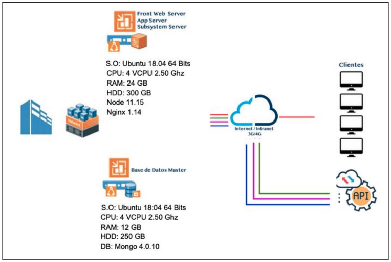
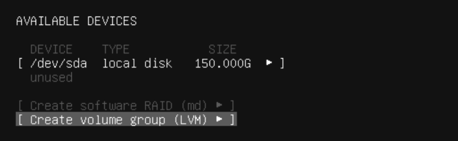
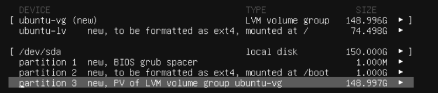
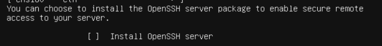

# **sac**
Repositorio del sistema de atención ciudadana

## **Diagrama de Infraestructura en el Municipio de León**

## **Requerimientos mínimos del servidor**

### **Servidor APP**
 - Sistema operativo Ubuntu 18.04
 - versión de Kernel 4.15
 - Node 11.15
 - Nginx 1.14.
 - Recursos de Hardware: 
    - RAM 8 GB
    - CPU 2 
    - HDD 150 GB. 

### **Servidor DB**
 - Sistema Operativo Ubuntu 18:04
 - versión de Kernel 4.15
 -  MongoDB 4.0.10
 - Recursos de Hardware: 
    - RAM 8GB
    - CPU 2
    - HDD 150 GB

Es importante considerar que estos valores son los recursos mínimos para el correcto funcionamiento del aplicativo, puede variar dependiendo la cantidad de usuarios, información y consultas que se tengan consideradas.

## **Pasos para habilitar el servidor**
Primero se realiza la instalación del sistema operativo de preferencia se recomienda instalar sin interfaz gráfica y únicamente con la siguiente opción de configuración en la partición:

Es importante manejar esta configuración para disponer del almacenamiento expandir en caso de ser necesario y no tener problemas.

Únicamente se instala el servicio de SSH:

Antes de iniciar la instalación de Node, Nginx y Mongo, es necesario llevar a cabo la actualización de paquetes y parches de seguridad con los siguientes comandos 

    sudo apt update    
    sudo apt upgrade

Activaremos el firewall del servidor y se agregan los puertos que se utilizarán tanto en el servidor App como en el BD, que se enlistan a continuación puertos y comandos:

### **Server APP**
    sudo ufw enable
    sudo ufw allow http
    sudo ufw allow 443
    sudo ufw allow 8080
    sudo ufw allow 8081
    sudo ufw allow SSH

### **Server BD**
    
    sudo ufw enable
    sudo ufw allow 27017
    sudo ufw allow SSH

## **Pasos para publicar el sitio y base de datos**

### **Server APP**
###  **- Instalación Nginx**

Se ejecutan los siguientes comandos: 

    sudo apt update
    sudo apt -y install nginx

Se valida el estatus de nginx una vez terminado la instalación:

    sudo systemctl status nginx

Se habilita el inicio automático del servicio de nginx:

    sudo systemctl enable nginx

### **- Configuración Nginx**
Se tiene que agregar el virtual host con el DNS que se defina en el archivo de configuración **default**, ubicado en la ruta **/etc/nginx/sites-available**:

    # Default server configuration
    #

    ###################
    server {
            listen   	80;
            server_name  nombre.com.mx;
            rewrite  	^ https://$server_name$request_uri? permanent;
        }

    server {
            listen   	443 ssl;
            server_name  nombre.com.mx;
    location / {
            proxy_pass http://127.0.0.1:8080;
            proxy_http_version  1.1;
        }
    }

Es importante y necesario contar con un certificado SSL para garantizar la comunicación segura entre el sistema y los usuarios finales, así como la compatibilidad con los principales exploradores.

Una vez que se tenga el certificado de Seguridad de agrega en el mismo archivo mencionado anteriormente con las siguientes líneas:

    ssl_certificate     /home/cert/cert/nombrecertificado.crt;
    ssl_certificate_key /home/cert/cert/nombrecertificado.key;

Una vez terminada la configuración del archivo, es necesario realizar una recarga del servicio de nginx para que tome los cambios realizados, con el siguiente comando:

    sudo systemctl reload nginx

### **- Instalación Node**
Se deben instalar los siguientes paquetes para el correcto funcionamiento de node.js con los siguientes comandos:

    curl -sL https://deb.nodesource.com/setup_11.x -o nodesource_setup.sh
    sudo bash nodesource_setup.sh
    sudo apt -y install nodejs

    curl -L https://www.npmjs.com/install.sh | sh
    npm i npm@6.7.0

Una vez terminada la instalación se ejecuta el siguiente comando para comprobar la versión instalada:
    
    nodejs -v
    npm -v

### **Servidor DB**
### **- Instalación Mongodb**
Se ejecutan los siguientes comandos:
    
    curl -fsSL https://www.mongodb.org/static/pgp/server-4.0.asc | sudo apt-key add -
    echo "deb [ arch=amd64,arm64 ] https://repo.mongodb.org/apt/ubuntu bionic/mongodb-org/4.0 multiverse" | sudo tee /etc/apt/sources.list.d/mongodb-org-4.0.list
    sudo apt update
    sudo apt install -y mongodb-org=4.0.10 mongodb-org-mongos=4.0.10 mongodb-org-server=4.0.10 mongodb-org-shell=4.0.10 mongodb-org-tools=4.0.10

Una vez instalado es necesario habilitar el inicio automático de los servicios de mongodb con el siguiente comando:

    sudo systemctl enable mongod

### **- Configuración Mongodb**
Para crear un usuario administrador se necesita editar el siguiente archivo **mongod.conf** que se encuentra en la siguiente ruta **/etc/mongod.conf** y se agregan las siguientes lineas con el siguiente comando:

    sudo nano /etc/mongod.conf

Líneas a editar: 
    
    security:
        authorization: enabled

Después es necesario reiniciar el servicio con el siguiente comando:

    sudo systemctl restart mongod

Iniciamos sesión en mongo:

    mongo

Seleccionamos la base de datos admin creada por default:
    
    use admin

Y creamos el nuevo usuario administrador, indicando su contraseña, rol y base de datos:
    
    > db.createUser({user: "instalador", pwd: "XXXXXXXX", roles: [{role: "root", db: "admin"}]})

Cerramos la conexión:
    
    > exit

Hasta este punto terminan las actividades de instalación y configuración de los servidores, para publicar el aplicativo, se necesita contar con IP´s públicas, y dar de alta el DNS en su servidores DNS internos y externos que se tengan.

